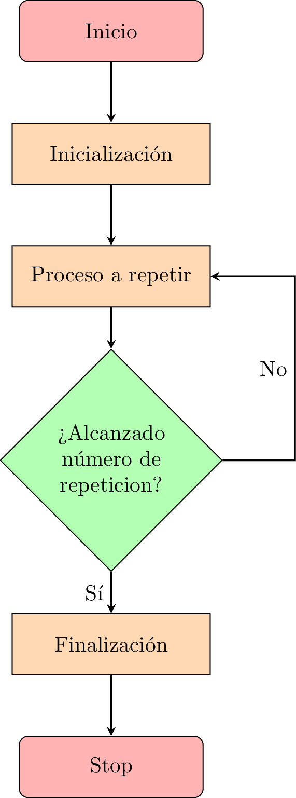

# Bucles en lenguaje ensamblador del microprocesador 8085

Los bucles son necesarios para realizar la ejecucción repetitva de una sección de código del programa. Todo programa que tenga que implementar un bucle con un número concreto de repeticiones tendrá una estructura similar a la que esquematiza el siguiente diagrama de flujo:



Veamoslo con un ejercicio.

_**Ejercicio:**_ Preparar un programa que escriba el valor 7AH en las posiciones de memoria 1100H a 110FH (16 bytes en total), usando para ello un bucle.


Al implementar un bucle que debe repetirse un número concreto de veces, en este caso 16, es necesario utilizar algún recurso como contador de repeticiones. Lo habitual es usar con este fin algún registro que, dependiendo del número de repeticiones, puede ser de 8 bits o bien una pareja de registros si dicho número excede de 256. El objetivo es simular una construcción equivalente a `FOR inicio TO fin/NEXT`` o similar de la que disponen la mayoría de los lenguajes de alto nivel.

Si además en el bucle va a ser necesario ir recorriendo posiciones consecutivas de memoria, como ocurre en el actual ejercicio, también será preciso emplear una pareja de registros como puntero, de lo contrario habría que especificar manualmente cada una de las direcciones y el bucle ya no sería tal.

Partiendo de las dos premisas anteriores, la resolución del ejercicio podría dividirse en tres bloques:

1. Inicialización de los registros que van a actuar como contador y puntero a memoria. Este bloque se ejecutaría únicamente una vez, al ponerse en marcha el programa.

2. Escritura del valor indicado en la dirección a la que apunta la pareja de registros elegida y actualización del contador, comprobando si se ha alcanzado el número de repeticiones establecido. Mientras no sea así, este paso seguirá repitiéndose.

3. Finalización del programa una vez que se haya alcanzado el número de repeticiones deseado. Este último bloque puede reducirse a la finalización del programa en sí, con una instrucción RST 1, o implicar algunos pasos adicionales, como puede ser el almacenamiento de un resultado final. 


El código quedaría de la siguiente manera:


```
CPU "8085.TBL"
HOF "INT8"
    
    ORG 1000H

    LXI D, 1100H    ; Posición de destino
    MVI C, 0H       ; Se usará C como contador
BUCLE:
    MVI A, 7AH      ; Se escribe el valor
    STAX D          ; indicado en esa posición

    INR C           ; Ya se ha escrito un valor más
    INX D           ; Avanzar a la siguiente posición
    
    MOV A, C        ; Comparar el contador con 10H (16d)
    CPI 10H

    JNZ BUCLE; Si aún no se han escrito 16 valores
    
    RST 1
END

```


