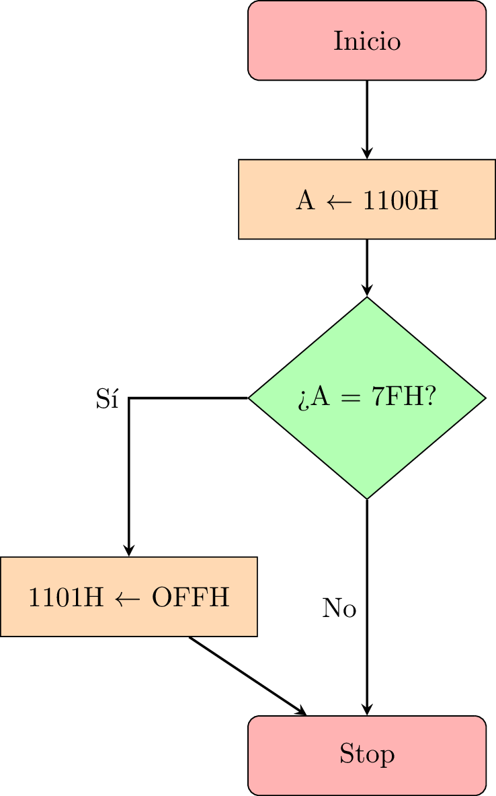

# Saltos condicionales en lenguaje ensamblador del microprocesador 8085

Los saltos condicionales de tipo _IF-THEN_ surgen de la necesidad de alterar la ejecución de un programa. Se busca desviar su ejecución en función de que se cumpla o no una condición que definimos en el código.


Veamos un ejemplo práctico.

Supongamos que queremos comprobar si el valor de la posición de memoria  memoria 1100H es igual a 7AH, y si lo es, escribimos en la posición 1101H el valor 0FFH. Tal como se indica en siguiente ordinograma:





El objetivo es simular la instrucción _IF-THEN_ con la que cuentan todos los lenguajes de alto nivel, de forma que una
cierta parte del programa se ejecute únicamente en caso de que se cumpla una condición.


```
CPU "8085.TBL"
HOF "INT8"
    
    ORG 1000H

    LDA 1100H
    CPI 7FH     ; Se compara A con 7FH
    JNZ FIN     ; Si no coincide, salta
    
    MVI A, 0FFH
    STA 1101H
FIN: RST 1
END

```


En el código se realiza lo siguiente:

1. Se carca el contenido de la posición de memoria 1100H `LDA 1100H`.

2. Se compara con la instrucción `CPI` el contenido del acumulador con un dato inmediato: 7FH. Dicha instrucción afectará al registro de indicadores activando unos u otros dependiendo del resultado.

3. Según el diagrama previo el programa continuará su flujo normal si el dato del acumulador es 7FH, desviándose la ejecución en caso contrario.

