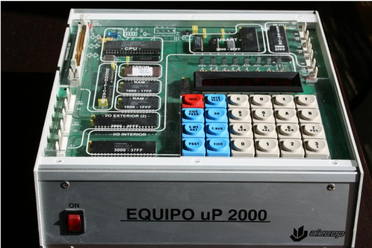
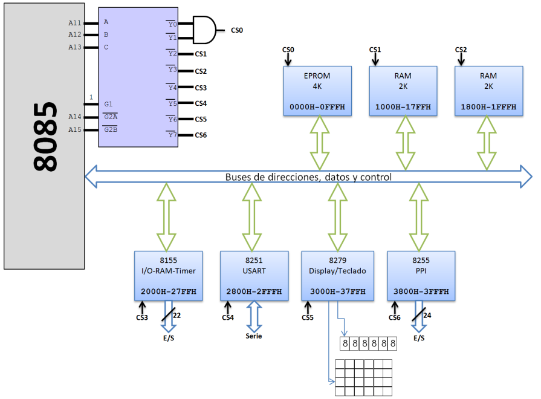
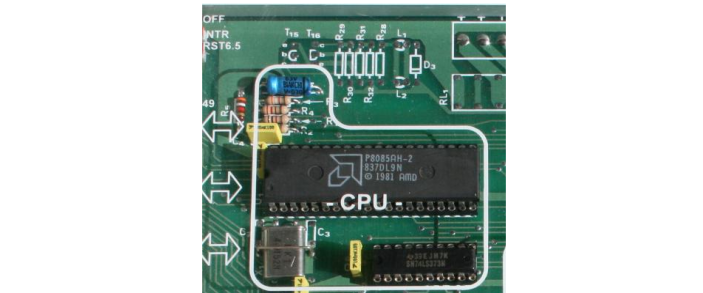
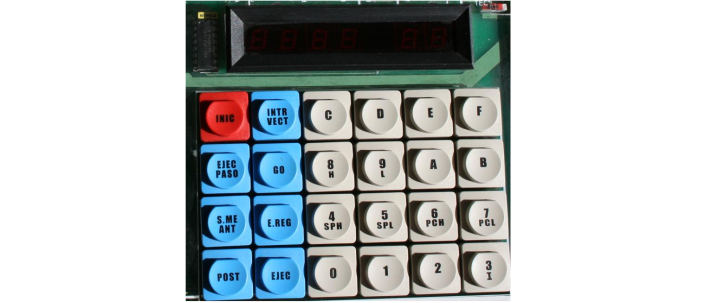
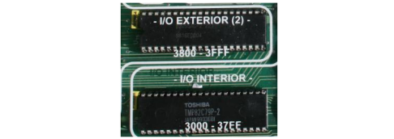
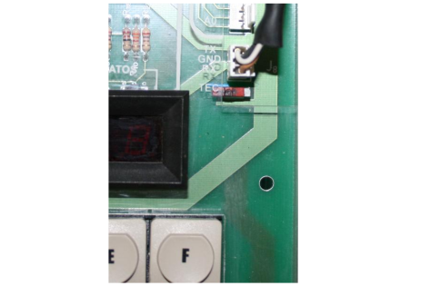
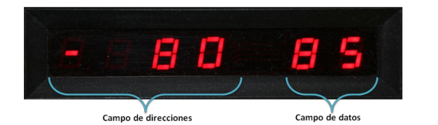
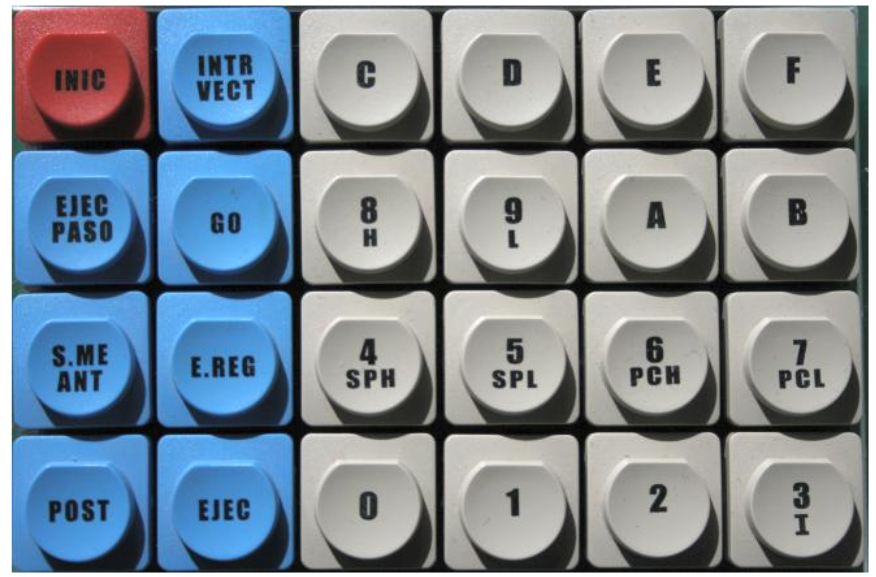

# Sistema uP-2000 basado en el microprocesador 8085

Un microprocesador aislado no tiene utilidad por sí mismo, para poder aprovechar sus posibilidades es necesario facilitarle alimentación eléctrica, una señal de reloj externa, memoria en la que almacenar datos y de la que leer el programa que debe ejecutar y, sobre todo, algún tipo de conexión que facilite la comunicación con los usuarios, ya que sin esto el resto no tendría sentido.

_Figura 1. Sistema uP-2000_

El sistema uP-2000 es lo que se conoce como un sistema basado en microprocesador, concretamente basado en el 8085. Desarrollado por la firma Alecop, este
sistema ofrece todos los elementos que se han mencionado antes y algunos más, como interfaces de comunicación serie y paralelo (usando módulos 8255 y USART), una pequeña pantalla numérica y un teclado y software monitor alojado en memoria EPROM.

El sistema uP-2000 permite trabajar con el microprocesador 8085 a distintos niveles, lo cual facilita el aprendizaje relativo a la programación de este micro y los dispositivos a él conectados.

El esquema de la figura siguiente es un diagrama de bloques en el que aparecen los elementos principales del uP-2000: el microprocesador 8085, el conjunto de
buses de direcciones, datos y control, los integrados auxiliares y la lógica de selección que permite activar uno u otro según las líneas que se activen en el bus de direcciones.

_Figura 2. Esquema de bloques del sistema uP-2000_

## Componentes que forman el sistema

El diseño físico del uP-2000, con una tapa de metacrilato transparente y serigrafiada, facilita la identificación visual de los componentes que forman este sistema, comenzando por el propio microprocesador que es claramente visible en la parte superior izquierda cuando se tiene el equipo orientado para operar sobre él.

_Figura 3. Situación del 8085 en el uP-2000_

La parte inferior derecha está ocupada por el teclado (véase la Figura 4), dividido en dos áreas diferentes: 16 teclas con dígitos hexadecimales y, a su izquierda, ocho teclas más con comandos. Sobre el teclado se encuentra el display numérico, una pequeña pantalla capaz de mostrar un máximo de seis dígitos en dos grupos: uno a la izquierda, conocido como campo de direcciones, y otro a la derecha denominado campo de datos. La visualización está basada en celdas de 7 segmentos, similares a las utilizadas en las calculadoras. Tanto el teclado como la pantalla están controlados por un 8279, integrado descrito anteriormente.

_Figura 4. Teclado y display del uP-2000_

El uP-2000 cuenta con tres módulos de memoria, son los integrados que pueden verse en la Figura 5, físicamente dispuestos verticalmente debajo del microprocesador. El primero de ellos es de tipo EPROM y contiene un software programado por el fabricante y que se denomina programa monitor. La finalidad de éste es indicar al 8085 qué debe hacer al iniciar el sistema, así como facilitar la comunicación a través del teclado, la pantalla y el resto de dispositivos de E/S que componen el sistema. También facilita una serie de rutinas de utilidad general que se describen más adelante.

Los otros dos integrados corresponden a la memoria RAM y serán, por tanto, los que faciliten el almacenamiento de los programas que se vayan codificando y los datos asociados. Cada uno de ellos tiene una capacidad de 2 Kbytes, por lo que en total el sistema cuenta con 4 Kbytes de RAM. Éstos ocupan las direcciones comprendidas entre 1000H y 1FFFH (en hexadecimal), mientras que la EPROM ocupa las posiciones 0000H a 0FFFH.

_Figura 5. Módulos de memoria_

Bajo los módulos de memoria se encuentra el 8255 (véase la Figura 6), componente encargado de controlar la entrada/salida de datos en paralelo a través de sus tres puertos, correspondientes a los conectores J2, J3 y J4, situados en el margen inferior izquierdo del uP-2000. Es posible conectar ahí un módulo externo con pulsadores, microinterruptores y leds, accediendo a estos elementos a través del PPI.

_Figura 6. Módulos 8255 (PPI) y 8279_

Además de los ya citados, en el interior del uP-2000 también se encuentran los siguientes componentes:

- **8155**: Es un módulo que cuenta con un reloj, puertos de entrada/salida y también una pequeña porción de memoria.

- **8251**: Conocido como USART, se encarga de facilitar la transmisión de datos en serie que, por ejemplo, hace posible la comunicación con un PC para la carga de programas. 

- **Decodificador**: Son dos circuitos integrados que facilitan la decodificación del mapa de direcciones del sistema uP-2000, según el esquema de la Figura 2.

- **Microinterruptores**: La tapa transparente del uP-2000 tiene algunas aberturas que permiten acceder a microinterruptores que modifican su funcionamiento. De éstos el más interesante es el que puede verse en la Figura 7, situado en la esquina superior derecha, ya que permite alternar el control entre el teclado y pantalla propios y el PC a través del conector serie.

_Figura 7. Microinterruptor que alterna entre teclado y PC_

Al alimentar el sistema uP-2000 en la pantalla debe aparecer la indicación - 8085, tal y como se muestra en la Figura8. De no ser así puede pulsarse la tecla INIC para inicializar el sistema. Si aún así no aparece ese mensaje posiblemente haya algún fallo.

_Figura 8. Aspecto del display del uP-2000 al conectarlo_

Como se indica en la propia Figura 8, la pantalla se encuentra dividida en dos zonas. La que ocupa el lado izquierdo es conocida como campo de direcciones y está formada por cuatro dígitos. El denominado campo de datos, en el margen derecho, se compone de dos dígitos. En ambos casos se usa siempre numeración hexadecimal, por lo que el campo de datos puede mostrar un byte y el de direcciones dos.

## Uso del teclado del uP-2000

Para comunicarse con el uP-2000 es indispensable conocer la función de cada una de las teclas de comando, así como el procedimiento a seguir para introducir direcciones o datos, lanzar la ejecución de un programa almacenado en memoria o comprobar el estado de los registros del procesador. En la Figura 9 puede verse un detalle del teclado del uP-2000.

_Figura 9. Detalle del teclado del uP-2000._

Las ocho teclas de comando del uP-2000 tienen el siguiente cometido:

- **INIC**: Se encuentra conectada a la patilla RESET del 8085, por lo que en cuanto es pulsada reinicia el microprocesador y, en consecuencia, el sistema. Puede ser utilizada para sacar al sistema de una situación de error o bloqueo.

- **INTR VECT**: Produce una interrupción 7.5 en el 8085, activando la ejecución del correspondiente vector situado en la memoria EPROM del uP-2000.

- **EJEC PASO**: Hace posible la ejecución de programas paso a paso, instrucción a instrucción, de manera que se permite examinar tanto los registros del procesador como la memoria a medida que se ejecuta un programa.

- **GO**: Usando el teclado del uP-2000 es posible introducir en la memoria del sistema un programa completo. Mediante esta tecla se lanzaría la ejecución de dicho programa, para lo cual habría que pulsarla, introducir la dirección de memoria donde comienza el programa y finalmente ejecutarlo con la tecla EJEC.

- **S. ME ANT**: Facilita el acceso a la memoria del sistema, bien sea para leerla o para modificarla. Al pulsar esta tecla la pantalla mostrará el valor 0000 en el campo de direcciones, momento en el que debe introducirse la dirección a examinar o modificar. Usando las teclas hexadecimales hay que escribir los cuatro dígitos de la dirección, que irán apareciendo en la pantalla. También puede utilizarse esta tecla, mientras está examinándose la memoria, para retroceder a la dirección anterior.

- **E.REG**: Examinar el contenido de los registros del procesador es una posibilidad interesante a medida que se ejecuta un programa, siendo ésa la finalidad de esta tecla. Al pulsarla el sistema quedará a la espera de que, usando el resto del teclado, se indique qué registro quiere examinarse.

- **POST**: Mediante esta tecla se confirma una acción, por ejemplo la introducción de una dirección de memoria cuyo contenido quiere leerse o modificarse, o bien se avanza a la dirección siguiente, dependiendo del contexto.

- **EJEC**: La finalidad de esta tecla es interrumpir el comando que esté en proceso actualmente, comando que puede ser una lectura/escritura en la memoria o la ejecución paso a paso de un programa.

Dependiendo del comando que se utilice el uP-2000 quedará a la espera de que se facilite una dirección de memoria o se elija un registro, según los casos, tareas para las que se recurrirá al área numérica del teclado.
