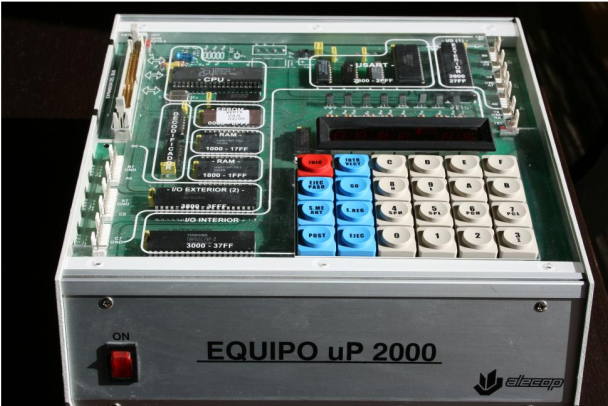

# Ejercicios resueltos de gestión de teclado y display uP-2000

En este artículo se muestra la solución a ejercicios relacionados con la gestión de teclado y display de un sistema uP-2000 para un microprocesador Intel 8085.


_Sistema uP-2000_


**_Ejercicio 1:_** Escribir un programa utilizando el lenguaje ensamblador del microprocesador 8085 que presente en el campo de datos la última tecla pulsada, y en el de direcciones, la suma acumulada de los códigos de las teclas pulsadas hasta el momento (p.e. la tecla A tiene código 0Ah). El carácter de escape (finalización del programa) será “EJEC”, con código asociado 10H.


**_Solución:_** 


```
ORG 1000H 
MVI A,04H 	
SIM
LXI SP, 2000H
MVI H,00H 
MVI L, 00H
MVI B, 00H	

BUCLE:
	PUSH H
	PUSH B
	CALL 044EH
	POP B
	POP H
	CPI 10H
	JZ SALIDA
	MOV B,A
	MOV A, L
	ADD B
	MOV L, A
	JNC NOCARRY
		INR H
NOCARRY: 
MOV A, B
PUSH H
PUSH B
CALL 04D5H
POP B
POP H
PUSH H
PUSH B
CALL 04C9H
POP B
POP H

JMP BUCLE

SALIDA:
END
```


**_Ejercicio 2:_** Escribir un programa utilizando el lenguaje ensamblador del microprocesador 8085 que presente en el campo de datos la última tecla pulsada, y en el de direcciones, la suma acumulada de las teclas con código asociado par pulsadas hasta el momento. El carácter de escape (finalización del programa) será “EJEC”, con código asociado 10H.


**_Solución:_** 


```

ORG 1000H 
MVI A,04H 	
SIM
LXI SP, 2000H
MVI H,00H 
MVI L, 00H
MVI B, 00H	

BUCLE:
	PUSH H
	PUSH B
	CALL 044EH
	POP B
	POP H
	CPI 10H
	JZ SALIDA
	MOV B,A

	RESTAMOS:
	SUI 02H
	CPI 01H
	JZ MOSTRAR
	CPI 00H
	JNZ RESTAMOS
MOV A,L
ADD B
MOV L,A

	JNC NOCARRY
		INR H
	NOCARRY: 
MOSTRAR:
MOV A,B
PUSH H
PUSH B
CALL 04D5H
POP B
POP H
PUSH H
PUSH B
CALL 04C9H

POP B
POP H
JMP BUCLE
SALIDA:
RST1
END	

	MOV A, L
	ADD B
	MOV L, A
	JNC NOCARRY
		INR H
NOCARRY: 
MOV A, B
PUSH H
PUSH B
CALL 04D5H
POP B
POP H
PUSH H
PUSH B
CALL 04C9H
POP B
POP H

JMP BUCLE

SALIDA:
END
```


**_Ejercicio 3:_** Escribir un programa utilizando el lenguaje ensamblador del microprocesador 8085 que presente en el campo de datos la última tecla pulsada, y en el de direcciones, la suma acumulada de las teclas con código asociado impar pulsadas hasta el momento. El carácter de escape (finalización del programa) será “EJEC”, con código asociado 10H.

**_Solución:_** 


```

ORG 1000H 
MVI A,04H 	
SIM
LXI SP, 2000H
MVI H,00H 
MVI L, 00H
MVI B, 00H	

BUCLE:
	PUSH H
	PUSH B
	CALL 044EH
	POP B
	POP H
	CPI 10H
	JZ SALIDA
	MOV B,A

	RESTAMOS:
	SUI 02H
	CPI 00H
	JZ MOSTRAR
	CPI 01H
	JNZ RESTAMOS
MOV A,L
ADD B
MOV L,A

	JNC NOCARRY
		INR H
	NOCARRY: 
MOSTRAR:
MOV A,B
PUSH H
PUSH B
CALL 04D5H
POP B
POP H
PUSH H
PUSH B
CALL 04C9H

POP B
POP H
JMP BUCLE
SALIDA:
RST1
END	

	MOV A, L
	ADD B
	MOV L, A
	JNC NOCARRY
		INR H
NOCARRY: 
MOV A, B
PUSH H
PUSH B
CALL 04D5H
POP B
POP H
PUSH H
PUSH B
CALL 04C9H
POP B
POP H

JMP BUCLE

SALIDA:
END
```


**_Ejercicio 4:_** Escribir un programa utilizando el lenguaje ensamblador del microprocesador 8085 que presente en el campo de datos la última tecla pulsada, y en el de direcciones, la suma acumulada del número de veces que se han pulsado hasta el momento las teclas cuyo código asociado sea mayor o igual que 05H. El carácter de escape (finalización del programa) será “EJEC”, con código asociado 10H.

**_Solución:_** 


```

ORG 1000H 
MVI A,08H 	
SIM
LXI SP, 2000H
MVI H,00H 
MVI L, 00H
MVI B, 00H	

BUCLE:
	PUSH H
	PUSH B
	CALL 044EH
	POP B
	POP H
	CPI 10H
	JZ SALIDA
	MOV B,A
	PUSH H
	PUSH B
	MOV B,A
	CALL 04D5H
	POP B
	POP H
	MOV A,B
	CPI 05H
	JC MENOR
	INR L
	MOV B,A
	PUSH H
	PUSH B
	CALL 04C9H
	POP B	
	POP H
	MENOR:
JMP BUCLE
SALIDA:
RST1
END
```

