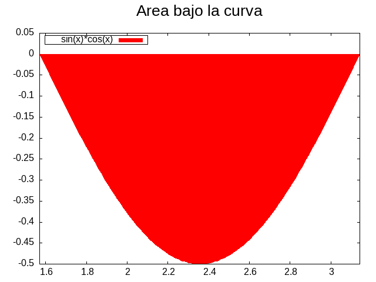

# Algunos ejercicios de integrales

## Integrales de senos y cosenos

**Ejercicio 1. Calcula la siguiente integral**

$$
\int_{\pi/2}^{\pi} sin(x) cos(x) \,dx
$$

Si definimos (haciendo un cambio de variable)

$$
u = sin(x)
$$

y 

$$
du = cos(x)dx \rightarrow 
$$

Tenemos que la solución de la integral será:

$$
\int sin(x) cos(x) \,dx = \int u \,du  = \frac{u²}{2}
$$

Evaluando tenemos:

$$
\int_{\pi/2}^{\pi} sin(x) cos(x) \,dx = \frac{sin²(x)}{2} ]^{\pi}_{\pi/2} =
$$

$$
= \frac{sin²(\pi)}{2} - \frac{sin²(\pi/2)}{2} = 0 - \frac{1}{2} = - \frac{1}{2}
$$

Gráficamente vemos que la solución es correcta. 

_Gŕafico realizado gnuplot. [⬇️ Descarga el script](sinxcosx.plt)_

