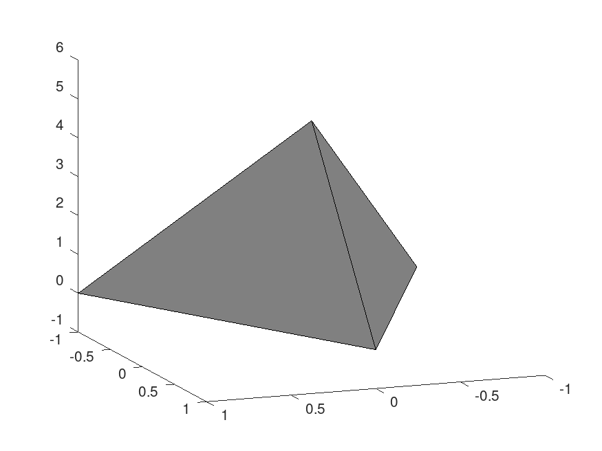
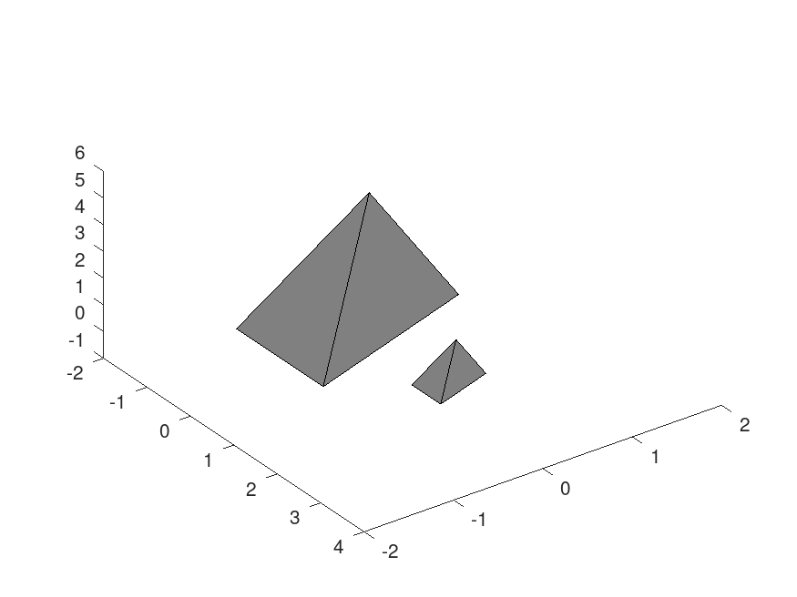
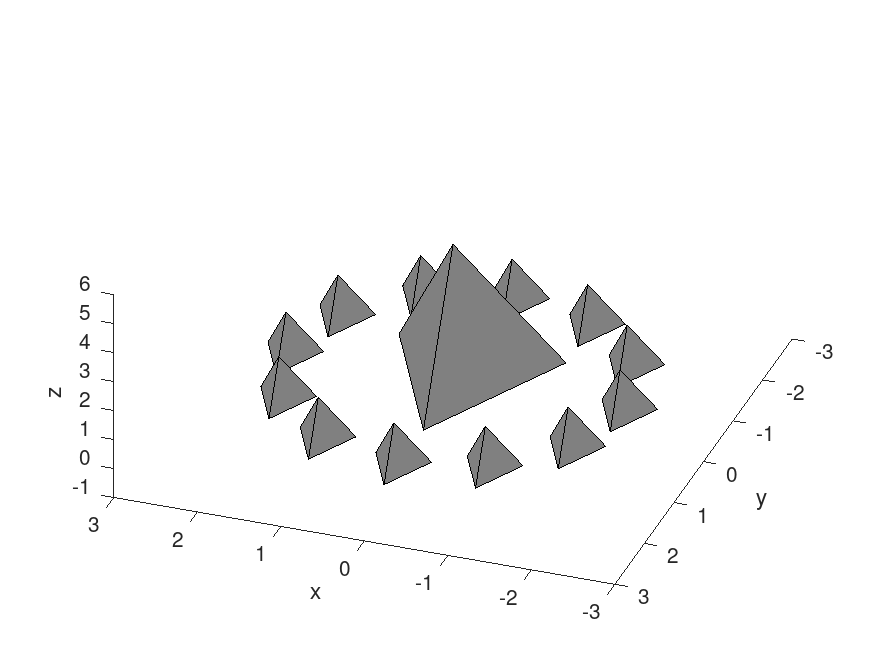

# Graficar pirámides en Matlab

Aquí queremos ver cómo podemos graficar un objecto tridimensional como es una pirámide usando la función `patch` de Matlab.


Para visualizar un objeto tridimensional usando `patch` hay que especificar los polı́gonos 2D que constituyen su superficie. Por ello creamos un objecto de tipo `struct`  en el cual definimos sus atributos para sus vértices (`piramide.vertices`) y sus caras (`piramide.faces`). Los valores de una cara se definen como los vértices que la componen (recuerda que debe ser un contorno cerrado).

Veamos con una ejemplo sencillo:

```matlab
% Creamos los vertices de la pirámide
piramide.vertices = [-1 -1 0;1 -1 0;0 1 0;0 0 5];
% Creamos sus caras
piramide.faces = [1 2 3;1 2 4;1 3 4;2 3 4];
% Graficamos con patch
patch(piramide, 'FaceColor', [0.5 0.5 0.5]);
axis([-1 1 -1 1 -1 6]);
% Guardamos la figura en una imagen
saveas(gcf,'piramide.png');

```





Si queremos deseamos incluir una réplica a escala menor, podemos hacer lo siguiente:

```matlab

% Definimos los vértices y caras de una pirámide
piramide.vertices=[-1 -1 0; 1 -1 0;0 1 0; 0 0 5];
piramide.faces=[1 2 3;1 2 4; 1 3 4; 2 3 4];
patch(piramide,'FaceColor',[0.5 0.5 0.5])
axis([-2 4 -2 2 -1 6])

% Definimos los vértices y caras de una mini pirámide
minipiramide.vertices=piramide.vertices.*1/3;
minipiramide.vertices(:,1)=minipiramide.vertices(:,1)+2;
minipiramide.faces=piramide.faces;
hold on; % Combinamos ambos tetraedros en una misma figura
patch(minipiramide,'FaceColor',[0.5 0.5 0.5])
% Guardamos la figura en una imagen
saveas(gcf,'piramide_y_minipiramide.png');
```




También podemos crear varias replicas de forma parámetrica usando coordenadas polares (`r`, `ang`).


```matlab
% Definimos los vértices y caras de una pirámide
piramide.vertices=[-1 -1 0; 1 -1 0;0 1 0; 0 0 5];
piramide.faces=[1 2 3;1 2 4; 1 3 4; 2 3 4];
patch(piramide,'FaceColor',[0.5 0.5 0.5])
axis([-3 3 -3 3 -1 6])
xlabel('x')
ylabel('y')
zlabel('z')

% Número de minipiramides
n = 12;

% Distancia radial entre minipiramide y piramide
r = 2;

ang = linspace(0,2*pi*(1-1/n),n);

% Creamos mini piramides alrededor de la piramide
for i=1:n
  
  minipiramide.vertices=piramide.vertices.*1/3;
  minipiramide.faces=piramide.faces;
  minipiramide.vertices(:,1)=(minipiramide.vertices(:,1)+r*cos(ang(i)));
  minipiramide.vertices(:,2)=(minipiramide.vertices(:,2)+r*sin(ang(i)));
  
  hold on;
  patch(minipiramide,'FaceColor',[0.5 0.5 0.5])
end

% Guardamos la figura en una imagen
saveas(gcf,'piramide_y_minipiramides.png');
```


