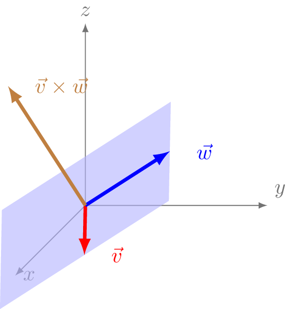

# Producto vectorial de 2 vectores

El producto vectorial de dos vectores da como resultado otro vector que es perpendicular al plano formado por ambos vectores. Su sentido se puede obtener mediante la regla de la mano  derecha y su módulo es el área formado por el área del paralelogramo que forman ambos vectores.

En ecuaciones quedaría de tal manera:

$$ \vec{v} \times \vec{w} = \begin{vmatrix} \vec{i} & \vec{j} & \vec{k} \\\ v_x & v_y & v_z \\\ w_x & w_y & w_z\end{vmatrix} = $$

$$ = v_yw_z \vec{i} +v_zw_x\vec{j} + v_x w_y \vec{k} - v_zw_y \vec{i}-v_xw_z\vec{j}-w_xv_y\vec{k} = $$

$$ =  (v_yw_z- v_zw_y) \vec{i} + (v_zw_x-v_xw_z)\vec{j} + (v_x w_y-w_xv_y) \vec{k}   $$

_Figura creada con tikz en LaTeX. Descarga el archivo [.tex ⬇️](producto-vectorial-plano.tex) o el [.pdf ⬇️](producto-vectorial-plano.pdf)_

## Método del ángulo y módulo

Una alternativa para calcular el producto vectorial es calculando el módulo y el sentido del módulo por separado: 

$$ |\vec{v} \times \vec{w}| = |\vec{v}|\cdot|\vec{w}|\cdot \sin{\theta} $$

siendo _&theta;_ el ángulo que forman ambos vectores.

El sentido del módulo se puede obtener mediante la regla de la mano derecha. El primer término del producto es el indicado por el dedo índice mientras que el segundo es el el dedo corazón y el producto está en el sentido del dedo pulgar. 

_Figura creada con tikz en LaTeX. Descarga el archivo [.tex ⬇️](mano-derecha.tex) o el [.pdf ⬇️](mano-derecha.pdf). También tienes aquí la  [image usada de fondo.](mano.png)_

Obviamente, esta alternativa se puede aplicar cuando los vectores son sencillos y se puede calcular la dirección gráficamente. Un ejemplo simple es que ambos vectores _v_ y _w_ se encuentren en en uno de los planos cartesianos (_xy_, _xz_ o _yz_).

---
**Ejercicios**. 

**1.** Demuestra las siguientes identidades:
$$\vec{i}  \times  \vec{j} = \vec{k}$$
$$\vec{j} \times \vec{k} = \vec{i}$$
$$\vec{k} \times \vec{i} = \vec{j}$$

_Solución:_

Puesto que los vectores unitarios _i_, _j_, _k_ se pueden expresar por sus coordenadas de la siguiente manera `i = (1,0,0)`, `j = (0,1,0)` y  `k = (0,0,1)`, podemos obtener fácilmente las identidades anteriores:

$$
\vec{i} \times \vec{j} = 
		\begin{vmatrix}
        \vec{i} & \vec{j} & \vec{k} \\\  1 & 0 & 0 \\\ 0 & 1 & 0 
		\end{vmatrix}  =  (  \cancel{0 \cdot  0} - \cancel{0 \cdot  1})\vec{i} + (\cancel{0 \cdot  0}-\cancel{1 \cdot  0})\vec{j} + (1 \cdot 1-\cancel{0 \cdot  1}) \vec{k}  = \vec{k}  $$

$$
\vec{j} \times \vec{k} = 
		\begin{vmatrix}
		\vec{i} & \vec{j} & \vec{k} \\\ 0 & 1 & 0 \\\ 0 & 0 & 1 
		\end{vmatrix}  =  ( 1 \cdot  1 - \cancel{0 \cdot  0})\vec{i} + (\cancel{0 \cdot  0}-\cancel{1 \cdot  0})\vec{j} + (\cancel{0 \cdot 0}-\cancel{0 \cdot  1}) \vec{k}  = \vec{i}
$$

$$\vec{k} \times \vec{i} = 
		\begin{vmatrix}
		\vec{i} & \vec{j} & \vec{k} \\\ 0 & 0 & 1 \\\  1 & 0 & 0 
		\end{vmatrix}  =  ( \cancel{0 \cdot  0} - \cancel{0 \cdot  1})\vec{i} + (1 \cdot  1 -\cancel{0 \cdot  0})\vec{j} + (\cancel{0 \cdot 0}-\cancel{1 \cdot  0}) \vec{k}  = \vec{j}
$$

**2.** Obtener el producto vectorial de _v_ por _w_, siemdo ambos:

$$\vec{v}   = 1.2 \vec{k}$$
$$\vec{w} = 0.7 \vec{i} + 0.9 \vec{k}$$

_Solución:_

Ambos vectores se encuentran en el plano _xz_, por tanto, su producto vectorial tendrá la dirección perpendicular, es decir su dirección es la del eje _y_. 	

_Figura creada con tikz en LaTeX. Descarga el archivo [.tex ⬇️](ejercicio2-vectores.tex) o el [.pdf ⬇️](ejercicio2-vectores.pdf)_

Por un lado, tenemos que el módulo será de _v_ y _w_ es respectivamente: 
$$ |\vec{v}| = 1.2 $$
$$|\vec{w}| = \sqrt{0.7^2+0.9^2}= 1.4140 $$

Y por otro, tenemos que ángulo que formas los vectores _v_ y _w_ viene dado por las coordenadas del vector de _w_:

_Figura creada con tikz en LaTeX. Descarga el archivo [.tex ⬇️](ejercicio2-angulo.tex) o el [.pdf ⬇️](ejercicio2-angulo.pdf)_

Por lo que podemos obtener _&theta;_ tal que así:

	
$$ \theta = arc tg \Big( \dfrac{0.7}{0.9} \Big) = 37,87^\circ $$

Ya tenemos todos los datos del problema:

$$ | \vec{v} \times \vec{w} | = |\vec{v}|\cdot|\vec{w}|\cdot \sin{\theta} = 1.2 \cdot 1.4140 \cdot \sin{37,87} = 1,042 $$

En su expresión vectorial el producto quedaría de la siguiente manera:

$$ \vec{v} \times \vec{w} = 1,042 \vec{j} $$

---
