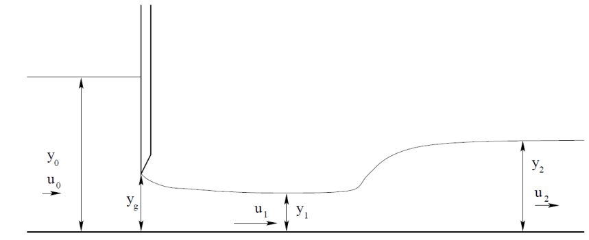

# El problema del resalto hidráulico

En la mecánica de fluidos, el problema del resalto hidráulico se engloba dentro del estudio del flujo permanente en canales abiertos. Un canal abierto se caracteriza por tener una superficie de interfaz entre el agua y el aire, esta interfaz denominada superficie libre está sometida a la presión atmosférica. Por lo tanto, el problema se simplifica si se compara con el flujo en conductos; concretamente el movimiento del fluido se asocia a los gradientes de presión producidos por las fuerzas másicas como es la aceleración de la gravedad.

## Generación de un resalto hidráulico

Una manera de generar un resalto hidráulico de manera controlada en un laboratorio es a través de una compuerta que aguas arriba tiene el flujo supercrítico deseado. El nivel de agua aguas arriba desde la compuerta _y0_ y su nivel aguas abajo desde la compuerta es _y1_. La apertura de la compuerta la denotamos como _yg_. Después del resalto se obtiene un nuevo nivel de agua cuya profundidad  _y2_. La compuerta es controlable verticalmente de manera que se podía modificar el valor de _yg_ con el fin de controlar el coeficiente de descarga y consecuentemente el número de Froude en el resalto aguas arriba del mismo. En un resalto hidráulico con esta configuración se tiene que _Fr1 > 1_ y _Fr2 < 1_. 

El número de Froude en ambos puntos viene definido al que así:

$$Fr_1 = u_1/\sqrt{gy_1}$$

$$ Fr_2 = u_2/\sqrt{gy_2} $$

donde _u1_ es la velocidad en el punto 1 (corriente supercrítica) y _u2_ es la velocidad de la misma en parte subcrítica o aguas abajo.

Veamos ahora el problema por tramos: el flujo a través de la compuerta y el resalto hidráulico.

## Flujo a través de una compuerta

La profundidad en la zona de descarga disminuye hasta finalmente la contracción del flujo finaliza y su profundidad se hace constante a una distancia determinada, _L_, de la compuerta; este punto lo denotamos con subíndice "1". La profundidad en dicho punto se relaciona con la apertura de la compuerta en términos de un coeficiente de contracción, "Cc", que se relaciona las propundidades en los puntos 1 y en la garganta:

$$y_1=C_cy_g$$
 
Para una compuerta plana se cumple lo siguiente:

$$L=y_g/C_c=y_g^2/y_2$$

Asumiendo un flujo estacionario, incompresible y uniforme, aplicamos la ecuación de Bernoulli aguas arriba y aguas abajo de la compuerta y tenemos:

$$
p_{atm}+pgy_0+ \frac{1}{2}\rho u_0^2=p_{atm} +pgy_1+ \frac{1}{2}\rho u_1^2 \quad \rightarrow $$ 
$$
\rightarrow  \quad y_0+\frac{1}{2g}u_0^2=y_1+\frac{1}{2g}u_1^2
$$

donde _patm_  es la presión atmosférica que vemos que no afecta finalmente a  la ecuación y las velocidades _u0_ y _u1_ se pueden aproximar a sus valores medios respectivos. Además, la conservación de flujo viene dada por la expresión siguiente:

$$
q=u_0y_0=u_1y_1
$$

dando lugar a 

$$u_0=u_1y_1/y_0$$ 

que sustituyendo en la ecuación Bernouilli tenemos,

$$
y_0-y_1=\frac{u_1^2}{2g} \left[1-\left(\frac{y_1}{y_0}\right)^2 \right] 
$$

O Expresada de otra manera:

$$
u_1^2 = \frac{2gy_0^2}{y_0+y_1} =\frac{y_0}{y_0+y_1}2gy_0 \quad \rightarrow \quad u_1=\frac{1}{\sqrt{1+\frac{y_1}{y_0}}}\sqrt{2gy_0}
$$

Si sustituimos _y1=Ccyg_ tenemos,

$$
u_1=\frac{1}{\sqrt{1+\frac{C_c y_g}{y_0}}}\sqrt{2gy_0}
$$

De este modo, podemos obtener el caudal como, 

$$
q=\frac{C_vy_1}{\sqrt{1+\frac{C_c y_g}{y_0}}}\sqrt{2gy_0}=\frac{C_vC_c}{\sqrt{1+\frac{C_c y_g}{y_0}}}y_g\sqrt{2gy_0}
$$

donde _Cv_ es comúnmente conocido como coeficiente de velocidad. La primera fracción del segundo miembro lo denominamos coeficiente de descarga,

$$
C_d=\frac{C_vC_c}{\sqrt{1+\frac{C_c y_g}{y_0}}}
$$

permitiéndonos reescribir la expresión del caudal como

$$
q=C_dy_g\sqrt{2gy_0} 
$$

El coeficiente de contracción _Cc_ depende del número de Reynolds y de la relación _y0/yg_ . En la figura siguiente se muestra la evolución del coeficiente de contracción con la relación de alturas para números de Reynolds suficientemente altos. Por otro lado, el coeficiente de velocidad se puede aproximar por la expresión siguiente:

$$
C_v=0.960+0.0979 \frac{y_g}{y_0}
$$

## Resalto hidráulico

En canales abierto, se considera un resalto hidráulico un salto brusco de profundidad y velocidad del flujo, esto se produce debido a los esfuerzos de fricción que hacen frenar al fluido cuya corriente es supercrítica y se hace subcrítica pasando por condiciones críticas (_Fr = 1_). Consecuentemente, el flujo pierde parte de su energía que se transforma en energía térmica de fricción entre partículas fluídas y en energía de agitación turbulenta. 

La conservación de la masa aplicada a un resalto hidráulico producido dentro de un canal rectangular la podemos expresar tal como,

$$
u_1 y_1 = u_2 y_2 = q
$$

mientras que aplicando la ecuación de conservación de la cantidad de movimiento en la dirección horizontal aguas arriba y aguas abajo del resalto, se obtiene una relación de profundidades,

$$
\frac{q^2}{gy_1}+\frac{y_1^2}{2}=\frac{q^2}{gy_2}+\frac{y_2^2}{2}
$$

proporcionando una solución positiva con sentido físico

$$
\frac{y_2}{y_1}=\frac{1}{2} \left(\sqrt{1+\frac{8q^2}{gy_2^3}}-1\right)=\frac{1}{2}\left(\sqrt{1+8Fr_1^2}-1\right)
$$

donde _Fr1_ es el número de Froude aguas arriba del resalto. Se observa que la relación de alturas (puntos 1 y 2) depende únicamente del este número.

$$Fr_1=u_1/\sqrt{gy_1}$$

Una cuestión importante en un resalto hidráulico es la cuantificación de pérdida de energía. Así pues despreciando la fricción del fluido con las paredes del canal tenemos que la pérdida de energía es la diferencia entre la presente aguas arriba y la que se tiene aguas abajo:

$$
y_l=\left(y+\frac{u^2}{2g} \right)_1 - \left( y+   \frac{u^2}{2g} \right)_2 
$$