# Velocimetría de partículas, PIV

La velocimetría de partículas es una técnica analítica no instructiva para el estudio de fluidos complejos que pueden ser estudiados tanto cuanti- como cualitativamente. El fluido es capturado gráficamente gracias al uso de las partículas trazadoras que tienen una densidad semejante a la del fluido y son capaces de reflejar la luz, éstas siguen el movimiento del fluido y son capturadas con la cámara digital. Normalmente, la fuente de luz usada en la velocimetría de partículas  es una de tipo láser que deberá estar activa cuando el sensor óptico esté tomando datos. El sensor óptico o cámara toma dos imágenes (A y B) en un instante muy corto de tiempo, en _t0_ y _t0+&Delta;t_  respectivamente, las almacena en un mismo fichero con el propósito de hacer _&Delta;t_ corto. En el hipotético caso de que se almacenara cada imagen por separado el conjunto sensor óptico-sistema de adquisición tardaría un tiempo extra en almacenar la primera imagen y por tanto _&Delta;t_ aumentaría, y se perdería información del flujo. El principio fundamental de la velocimetría de partículas  es la posibilidad de obtención de información del campo de desplazamiento de partículas, y por consiguiente del fluido, a partir de una evaluación de la correlación cruzada de las dos imágenes. Además con la variación temporal _&Delta;t_ se pueden obtener el campo de velocidades sabiendo el desplazamiento de las partículas de A a B. Para obtener el campo de desplazamiento en la velocimetría de partículas, se usan pequeñas áreas en las imágenes denominadas ventanas de computación  o áreas de interrogación, en las cuales se evalúa, mediante procesamiento de imágenes, el desplazamiento más probable para un grupo de partículas pasando en línea recta de A a B _[Thielicke, 2014]_.

## Principio físico

Un experimento de velocimetría de partículas  consiste generalmente en varios subsistemas. En la mayoría de los casos se añaden partículas trazadoras al flujo, aunque también es posible usar burbujas de aire si el flujo a estudiar es una interacción agua-aire. Las partículas -- o burbujas -- deben estar iluminadas en el plano del flujo al menos dos veces en un periodo muy corto de tiempo. La fuente de luz láser queda dispersa por las partículas y se realizan capturas a lo largo del tiempo de la experimentación. El desplazamiento de las partículas capturadas en las imágenes se evalúa gracias al procesamiento de las mismas.  

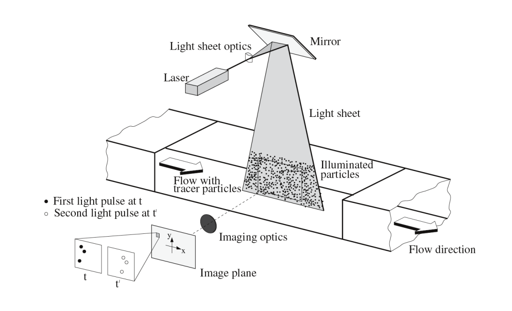

En la figura se muestra un experimento típico de velocimetría de partículas en un túnel de viento. El flujo es iluminado en una delgada lámina de luz láser fluorescente. El paso de tiempo necesario, _&Delta;t = t' - t_, entre captura y captura depende de la velocidad media del flujo y de la amplificación o zona de las capturas. Se asume que las partículas trazadoras se mueven con velocidad local del flujo a estudiar. Las imágenes tomadas en los diferentes instantes de tiempo (_t_ y _t'_) capturan las partículas que reflejan la luz láser mediante mecanismos de dispersión. La cámara recoge los datos de las imágenes y las almacena directamente en un ordenador.

La evaluación de las capturas se realiza posteriormente una vez acabado el experimento. Las imágenes se subdividen en pequeñas áreas, llamadas ventanas de interrogación, para realizar el cálculo del campo de desplazamientos locales mediante métodos estadísticos como la correlación cruzada. Se asume que en las ventanas de interrogación el flujo se mueve de manera homogénea entre dos capturas. El campo de velocidad se obtiene teniendo en cuenta el campo de desplazamientos y el paso de tiempo entre captura y captura, _&Delta;t_.

## Pre-procesado de las imágenes

Una vez disponibles las imágenes (A y B) para llevar a cabo su estudio es conveniente, en algunas ocasiones, realizarles un pre-procesado antes de ser evaluadas por la correlación cruzada. La necesidad de realizar el pre-procesado se justifica con la mejora de la calidad en la fase posterior de procesado o evaluación, _[Raffel et al., 2007, Shavit et al., 2007]_. En esta sección se mencionan las técnicas de pre-procesado o filtro que se pueden aplicar a las imágenes.

### Compensación del histograma, CLAHE

La ecualización o compensación del histograma adaptativa de contraste limitado (CLAHE, _Contrast Limited Adaptive Histogram Equalization_ en inglés) se desarrolló para aumentar la legibilidad de la imagen principalmente en aplicaciones médicas _[Pizer et al., 1987]._  Su lugar de actuación se encuentra en áreas pequeñas de la imagen; las intensidades de luz más frecuentes se expanden a todo el rango de datos de intensidad que puede tener una imagen. Por ejemplo, el rango de intensidades de una imagen monocromática de 8 bits será de 0 a 255. Las regiones tanto como con baja exposición o alta se optimizan de forma independiente. Los autores del estudio _Shavit et al. [2007]_ aseguran con esta técnica un aumento de la probabilidad de detectar vectores válidos en un _4.7 ±  3.2%_ .

### Filtro de paso-alto de la intesidad luminosa

La aplicación de un filtro de paso-alto en la intensidad luminosa de la imagen elimina valores bajos de intensidad que se consideran información de baja frecuencia de fondo. Esta información se genera a causa de una iluminación no homogénea en los experimentos, por lo que se considera un obstáculo para la evaluación del PIV. De esta manera, se conserva la información de las partículas que tienen frecuencias (o valores de intensidad) altas _[Gonzalez, 1987]_. Por tanto, el filtro hace hincapié en los valores altos de intensidad que son los que caracterizan las partículas y elimina cualquier información de baja frecuencia en las imágenes, incluyendo toda la información de desplazamiento de baja frecuencia, _[Thielicke, 2014]_. 

### Limitación de intensidad

El filtro de la limitación intensidad es la aplicación de un límite alto en la misma en la escala de grises. Técnica totalmente opuesta al filtro paso-alto (\ref{intensity_highpass}): los valores de intensidad que superan el límite se sustituyen por el mismo. Con este filtro se consigue evitar intensidades altas que contribuyen estadísticamente a evaluar una ventana de interrogación tenga un flujo homogéneo, lo cual no sucede en la realidad ya que se tiene un flujo no uniforme _[Shavit et al., 2007]_. A diferencia de CLAHE, con esta técnica sólo una pequeña parte del histograma es ajustado, lo que limita el potencial impacto negativo de las modificaciones en la imagen. Esta técnica mejora la probabilidad de detectar vectores válidos en un _5.2 ± 2.5%_, _[Shavit et al., 2007]_. 

## Procesado de las imágenes

La parte más delicada de un análisis PIV es la correlación cruzada. Esta parte  tiene gran impacto en la precisión del PIV. Se realiza una correlación de las ventanas de interrogación con un par de imágenes para obtener el desplazamiento de las partículas más probable dentro de cada ventana de interrogación. En esencia, la correlación cruzada es un patrón estadístico que busca identificar las partículas de una imagen en la otra. Esta técnica estadística se implementa con la función discreta de correlación cruzada, ecuación siguiente de _[Huang et al., 1997]_.

$$
C(x,y)= \sum_{i} \sum_{j} I(i,j) \cdot I'(i+x,j+y) 
$$

Las variables _I_ y _I'_ representan los valores de intensidad de las ventanas de interrogación correspondiente a las imágenes A y B, respectivamente. Observa el esquema de la figura para endender mejor el concepto:

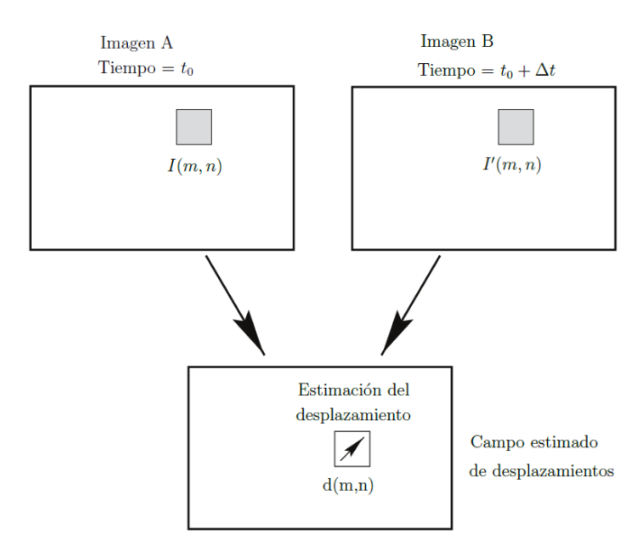
_Concepto de ventanas de interrogación_

Esta función realiza una comparación para ver la concordancia entre las ventanas de interrogación _I_ y _I'_ para un desplazamiento dado. La localización del pico de intensidad resultante de la matriz de correlación _C_ proporciona el desplazamiento más probable de _I_ a _I'_ _[Huang et al., 1997]_. 

Se disponen de dos aproximaciones para resolver la ecuación anterior. La aproximación más directa es mediante el cálculo de matriz de correlación, _C_, en el dominio del espacio. Otra aproximación para el cálculo de _C_ es en el dominio de la frecuencia mediante la transformada de Fourier (DFT).

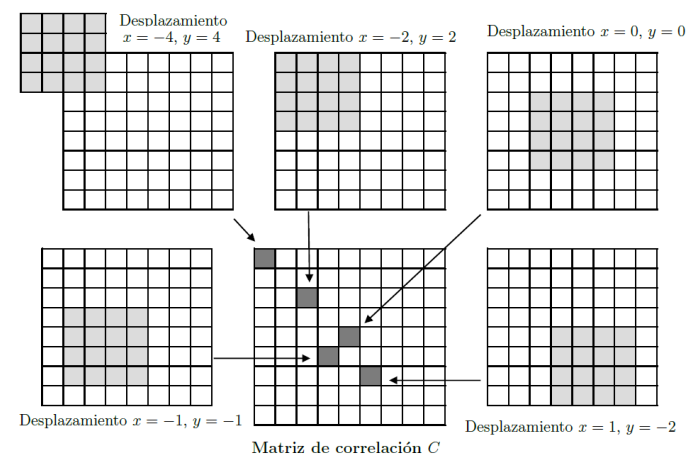
_Cálculo de la matriz de correlación mediante el uso de DCC. El área de interrogación _I_ (4 × 4 pixels) es correlacionado con el área de interrogación _I'_ (8 × 8 pixels) y se obtiene la matriz de correlación (9 × 9 pixels). Figura adaptada de la referencia [Thielicke, 2014]._

Mediante estos dos métodos se puede calcular el desplazamiento lineal que han sufrido las partículas y en consecuencia el flujo. Lo que no se podrá determinar es la curvatura que han sufrido las partículas ya que sólo disponemos de dos capturas en el tiempo; otra limitación es no se puede obtener la aceleración. Por tanto, las dos imágenes, A y B, producen un campo de desplazamientos consistente en vectores lineales en los que cada vector es el resultado de analizar estadísticamente el movimiento de un grupo de partículas en una zona concreta _[Raffel et al., 2007]_. Para la realización de este análisis se hace uso de las ventanas de interrogación.

## Correlación cruzada directa, DCC

La correlación cruzada directa calcula la matriz de correlación _C_ en el dominio del espacio. Esta técnica trabaja normalmente con ventanas de interrogación (_I_ y _I'_) de diferente tamaño _[Stamhuis, 2006]_. Las ventanas de interrogación tienen valores de intensidad de luz. La ventana de interrogación _I_ se mueve linealmente a lo largo de _I'_ (que debe tener un tamaño igual o mayor que _I_) para realizar el cálculo de la matriz de correlación _C_ _[Raffel et al., 2007]_. Para cada juego de recorridos de _I_ (_x,y_), la suma de los productos de todos los valores de intensidad en los píxeles superpuestos de _I_ e _I'_ producen un valor de correlación _C(x,y)_. Aplicando la operación a todos los rangos de los recorridos de _I_ sobre _I'_,

 $$ -M \leq x \leq +M $$
 $$-N \leq y \leq +N $$,
 
se obtiene una matriz de correlación de tamaño _(2M+1) × (2N+1)_. Los valores máximos de la matriz de correlación se dan para valores de intensidad donde un grupo de partículas de la imagen A se repiten en la otra imagen B.

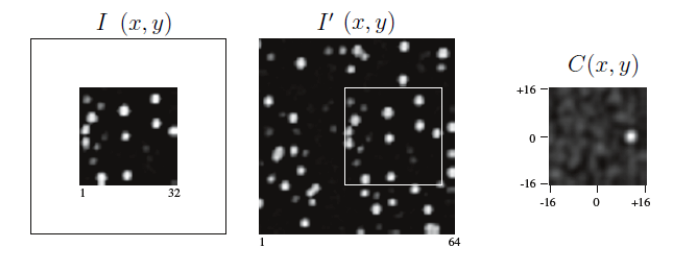
_Obtención de la matriz de correlación C(x, y) a partir de las ventanas de interrogación I de tamaño 32 × 32 píxeles e I' con 64 × 64 píxeles. Figura adaptada de la referencia [Raffel et al., 2007]._

## Correlación basada en la transformada de Fourier, DFT

Una alternativa para calcular la matriz de correlación es resolverla en el dominio de la frecuencia utilizando utilizando menos coste computacional que la técnica anterior. En DFT, se aprovecha el teorema de la correlación que sostiene que la correlación cruzada de dos funciones es equivalente a una multiplicación de complejos conjugados por sus transformadas de Fourier.

$$
C \Longleftrightarrow \hat{I} \cdot \hat{I'}^*
$$

donde el segundo miembro de la ecucación representa las transformadas de Fourier de las funciones _I_ e _I'_.

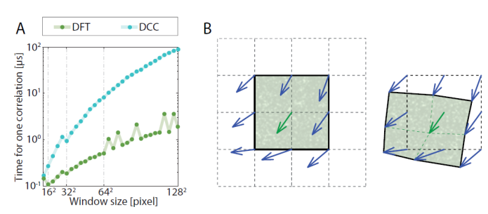
_A: Coste computacional de los métodos DFT y DCC. B: Principio de la técnica de la ventana de deformación. Extraída de la referencia [Thielicke, 2014]._

Este método utiliza áreas de interrogación con el mismo tamaño, lo que implica que se pierda cierta información y se traduce en ruido de fondo en la matriz de correlación. Este ruido dificulta la detección del pico de intensidad y disminuye la precisión. Es necesario, por tanto, reducir el tamaño del recorrido de las ventanas de interrogación en comparación con el DCC. 

Hasta el momento se ha asumido que las partículas tienen el mismo movimiento dentro de una ventana de interrogación, lo cual no es el caso de los flujos reales. Para atenuar esto, se proponen diferentes métodos que representan la transformación de las áreas de interrogación: métodos denominados ``paso múltiple, refinamiento de la cuadrícula o técnica de deformación de la ventana". En PIVlab se implementa el siguiente procedimiento. Se realiza primeramente el DFT común; la primera pasada del método da lugar a un desplazamiento en el centro de cada ventana de interrogación. Cuando hay superposición entre las ventanas (por ejemplo un _50%_), obtenemos información de desplazamiento adicional en los bordes y esquinas de cada ventana (nueve posiciones en total. Con estos desplazamientos se puede calcular los desplazamientos en cada pixel mediante la interpolación bilineal o con spline. Posteriormente, el área de interrogación _I'_ se deforma de acuerdo con esta información de desplazamiento. La siguiente pasada de las ventanas de interrogación correlaciona el área _I_ de interrogación original con el área deformada _I'_. Se acumula la información de desplazamiento restante de cada pasada. Después de varias pasadas, los áreas de interrogación (deformada de _I'_ e _I_) serán casi idénticos, y por tanto el desplazamiento determinado se obtiene con gran precisión. 

## Localización del pico

El desplazamiento de dos pares de áreas de interrogación (_I_ e _I'_) se puede determinar directamente donde la ubicación del valor de la intensidad de la matriz de correlación es máxima. La ubicación se puede refinar con precisión subpíxel utilizando una variedad de métodos. Estas técnicas de estimación de subpíxeles existentes se probaron en PIVlab y se implementaron en el mismo los dos métodos más prometedores en términos de precisión, velocidad y universalidad _[Thielicke, 2014]_. Estos métodos son: la función gaussiana con _2 × 3_ puntos de ajuste; y la función gaussiana bidimensional con 9 puntos de ajuste en total. Para el primer caso, se realiza uso únicamente de los píxeles verticales y horizontales adyacentes (dos veces un ajuste de 3 puntos) y se evalúa los ejes _x_ e _y_ por separado, ver figura siguiente. En el segundo caso, la interpolación se realiza teniendo en cuanta la influencia de ambos ejes, no se evalúan por separado. 

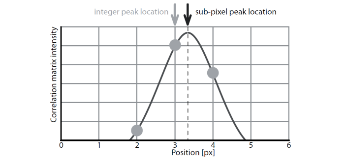
_Principio de la función gaussiana 2 × 3 puntos de ajuste de subpíxeles de precisión se consigue mediante el ajuste de una función gaussiana unidimensional (línea continua) para la distribución de intensidad entero de la matriz de correlación (puntos) para ambos ejes de forma independiente. Aquí sólo se muestra el ajuste para un eje. Figura extraída de [Thielicke, 2014]_

## PIVlab

PIVlab es una herramienta desarrollada en Matlab  por William Thielicke durante su tesis doctoral con el profesor Dr. Eize J. Stamhuis para analizar la velocimetría de partículas usando como entrada imágenes. Esta herramienta es de distribución libre y pero para su correcto funcionamiento se necesit una licencia de  Matlab y la opción o _toolbox_ de procesamiento de imágenes. 

El usuario de PIVlab puede tanto interactuar con la herramienta a través de la interfaz gráfica como directamente por la línea de comandos de Matlab.

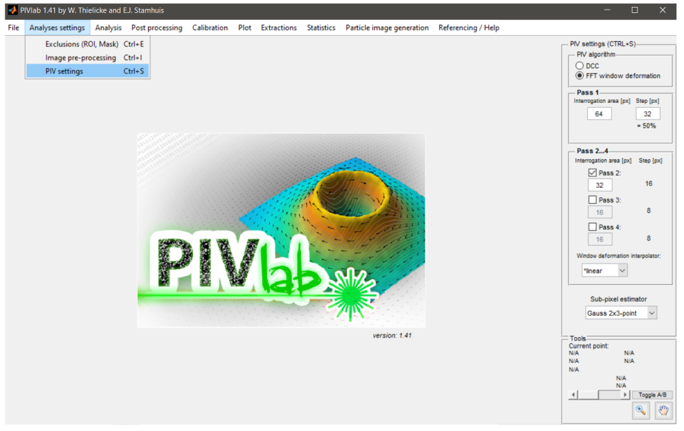
_Interfaz gráfica de PIVlab_

El corazón de la herramienta es la correlación de la técnica PIV, la cual ofrece al usuario dos técnicas; la correlación cruzada directa (en dominio espacial) y la correlación basada en la transformada de Fourier (en dominio de frecuencias). Los datos procesados con cualquiera de las técnicas pueden ser validados, interpolados y suavizados dentro de la interfaz gráfica de la herramienta. PIVlab dispone también de multitud de formatos para exportar los datos ofreciendo al usuario poder manipular éstos fuera de su entorno. El procedimiento a seguir se establece en los siguientes puntos: 

Primeramente, deberemos seleccionar los pares de imágenes que queremos analizar. Haciendo click en "Load images" en la ventana de la herramienta que se obtiene al entrar en la herramienta o al crear una nueva sesión, podemos seleccionar las imágenes que queremos analizar. Es importante seleccionar la secuencia de las mismas. Así, por ejemplo, si seleccionamos la secuencia "1-2, 2-3, 3-4, ..." quiere decir que hay una imagen que se comparte en cada par de ellas, mientras que si elegimos la secuencia "1-2, 3-4, 5-6, ..." tenemos que no se comparte, todas son distintas. En nuestro caso, tenemos la segunda secuencia. 

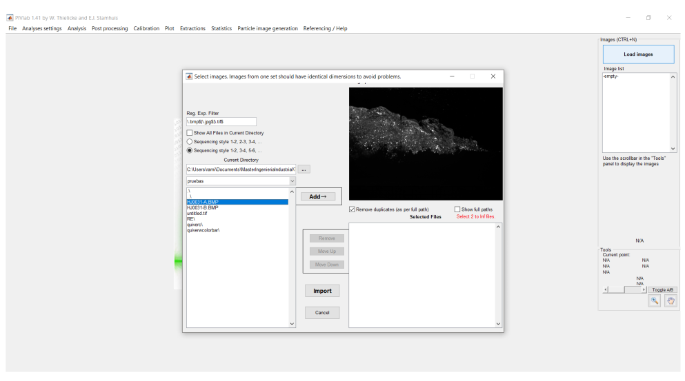
_Carga de imágenes para análisis_

Una vez seleccionadas las imágenes, hacemos click en "Add" y las añadimos al lugar un área de trabajo de la herramienta para validad que las imágenes seleccionadas son las correctas. En el área de trabajo "Selected Files" se puede ordenar las imágenes seleccionadas en caso de no tener un orden alfanumérico previo, lo cual es totalmente recomendable para análisis con grandes cantidades de archivos de imágenes a analizar como en nuestro caso. Ya ordenadas y seleccionadas con la secuencia correspondiente, importamos los archivos seleccionados haciendo click en "Import". 

Previamente a la correlación, se deberán definir los parámetros de la misma. Por otro lado, PIVlab nos da la opción de tratar las imágenes con los métodos mencionados previamente. No obstante, no es necesario el tratamiento si las originales ofrecen buenos resultados en la correlación. Otra característica de la herramienta es la de poder analizar una única zona de las imágenes si hacemos click en ``Exclusions (ROI, Mask)". 

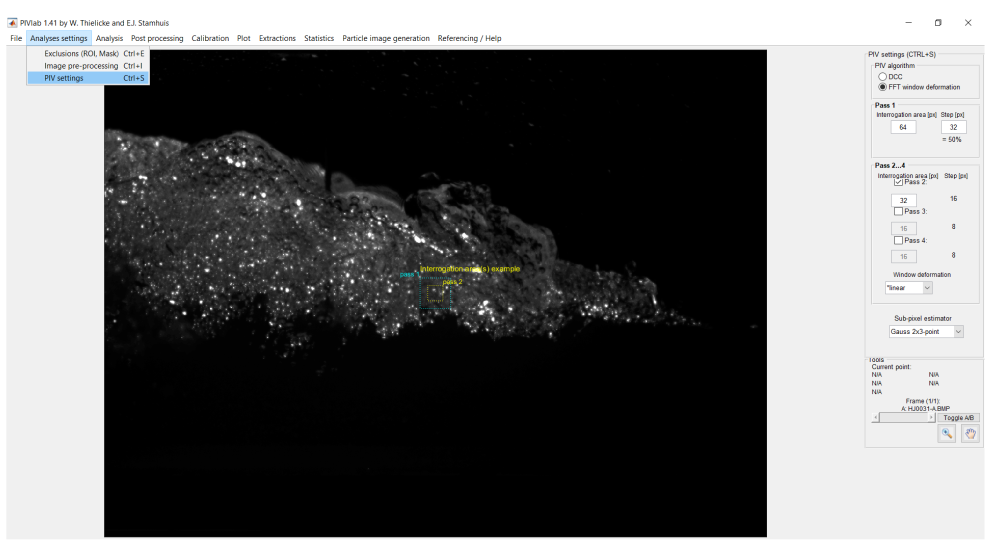
_Configuración de la correlación PIV_

Al configurar el análisis, la herramienta representa en las imágenes las ventanas de interrogación que se han seleccionado para realizar la correlación. Esto nos sirve para comparar el tamaño de las ventanas con el de las imágenes, así podemos predecir que la correlación va a ser adecuada aproximadamente. 

En nuestro caso, para analizar un resalto hidráulico, hemos seleccionado la correlación basada en la transformada de Fourier empleando dos ventanas de interrogación para el análisis de todas las imágenes. El primer paso se realiza cada 32 píxeles con una ventana 64 x 64 y el segundo cada 16 píxeles con una de 32 x 32. Por tanto, el solapamiento entre ventana y ventana para ambos pasos es el _50%_. La deformación de la ventana se ha establecido de manera lineal y el método estimador de sub-píxeles se realizado mediante la función gaussiana con _2 × 3_ puntos de ajuste.

Para realizar la correlación en sí, debemos ir a "Analysis". En dicha ventana nos encontramos dos opciones para analizar las imágenes:

* "Analyze current frame": se analiza el par de imágenes que se está visualizando.
* "Analyse all frames" se analiza toda la secuencia seleccionada.

Haciendo click en cualquiera de las opciones según corresponda, podemos ver los resultados que nos ofrece la correlación seleccionada. En el caso de obtener resultados no refinados y/o no deseados (vectores en rojo), podemos borrar los datos en "Clear all results" y volver a configurar los parámetros de correlación. 

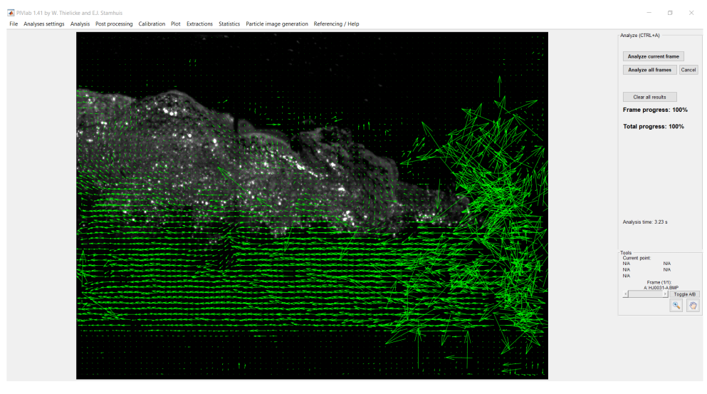
_Correlación del par de imágenes_

Puede ocurrir que en general la correlación sea buena, sin embargo alguna zona de las imágenes ofrece una deficiente correlación por no disponer de partículas trazadoras o en nuestro caso de no disponer de burbujas que tienen la misma función que las partículas. Si observamos la figura del análisis, podemos apreciar mucho ruido en los vectores de velocidad en la zona de la punta del resalto, donde no se han formado las burbujas aún. Esto se puede solucionar realizando filtros que detallamos a continuación.

A priori, PIVlab desconoce lógicamente la correspondencia de las unidades con las imágenes y el paso temporal entre captura y captura. Por ello, se habilita una ventana ("Calibration") para calibrar la distancia y el tiempo usado en la correlación. Primeramente, seleccionamos una distancia de referencia en la imagen haciendo click en "Select reference distance" y posteriormente indicamos la distancia real en _mm_ correspondiente. A continuación indicamos el intervalo de tiempo entre captura y captura en _ms_. Finalmente se aplica la calibración y a partir de entonces se tienen en cuenta los valores en unidades del SI en la memoria de la aplicación.

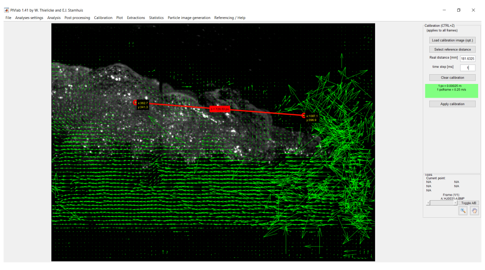
_Calibración espacial (4px = 1mm) y temporal (tiempo entre captura y
captura = 1ms)_

En las imágenes analizadas, el tiempo para un par de imágenes se tiene en cuenta el paso temporal entre una captura y otra, el cual es _1 ms_ ya que la cámara se configuró para hacer capturas a _1 kHz_. En cuanto a la calibración espacial, se ha hecho uso de la cinta métrica que se dispone en las imágenes y se ha calculado la correspondencia entre píxeles y mm (_1 mm = 4 px_). 

Se recomienda realizar la validación una vez se haya hecho la calibración ya que se trabaja con unidades más comprensibles. Así pues, haciendo click en "Post procesing" y seguidamente en "Vector validation" accedemos a la ventana donde se realiza la validación.

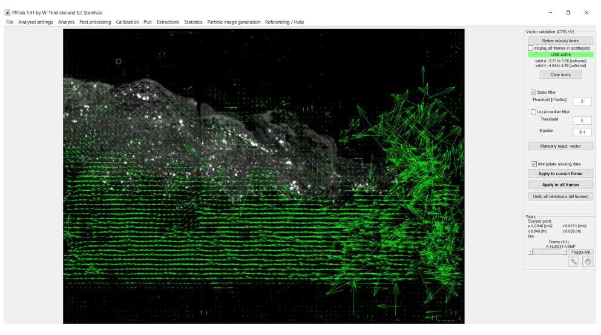
_Ventana de validación, sin aplicación de filtros_

En dicha ventana, tenemos tres opciones para ejecutar la validación. Primeramente, disponemos de selección de la posibilidad de limitar las velocidades horizontales y verticales mediante un recuadro en un gráfico _u_ vs. _v_. Seguidamente, se ofrece la posibilidad de seleccionar un umbral en términos de veces la desviación típica para filtrar las velocidades, este método aplica el mismo umbral tanto en velocidades verticales como horizontales, sin embargo la desviación típica de ambas no tiene porqué se igual. Finalmente es posible realizar un filtro con la mediana local de los vectores, un método más sofisticado que se expone en bibliografía _[Westerweel and Scarano, 2005]_.

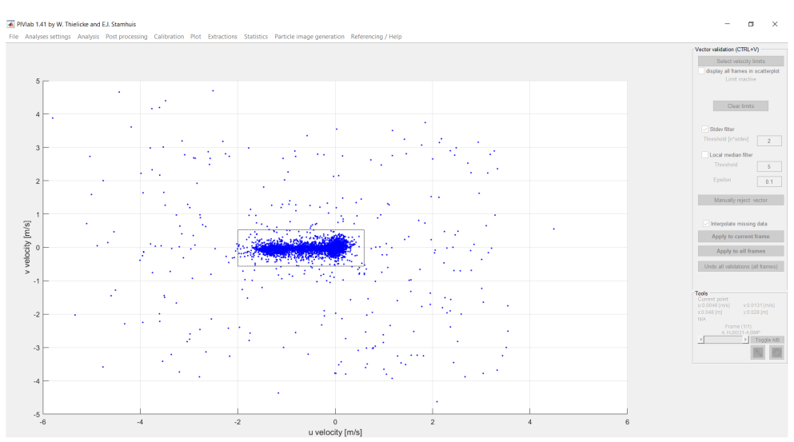
_Selección de recuadro de límites de velocidades horizontales y verticales_

En nuestros análisis, hemos seleccionado el primer método ya que la correlación entre capturas es buena a excepción de la zona de la punta que aparecen vectores demasiado elevados que necesitan ser corregidos. Así los valores fuera del intervalo _-2 m/s < u < 0.5 m/s_, _-0.4 m/s < v < 0.4 m/s_ se han interpolado por valores de alrededor. Aplicando lo mencionado se obtiene un nuevo campo de velocidades más realista. Aparece en vectores en color naranja como indicación de que se han sido interpolados. Es importante definir si los vectores a validar se deben interpolar  o  eliminar, pues ya que disponemos de ambas opciones; si queremos interpolar los datos que están fuera del intervalo debemos marcar con un tick la casilla de "Interpolate missing data", si por el contrario queremos eliminarlos la dejamos en blanco. 

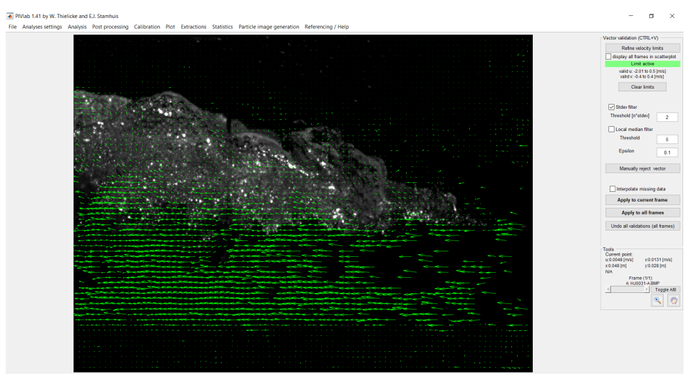
_Aplicación de límites por límites en velocidades horizontales y verticales. Eliminación de vectores fuera de rango_

En el caso de obtener un campo de velocidades no deseado o no coherente con lo esperado, es posible deshacer la aplicación del filtro presionando en "Undo all validations (all frames)". Así pues, se puede ir probando cada uno de los filtros que ofrece la herramienta y ver cuál es el que satisface mejor el problema que estamos analizando, siempre y cuando se justifique el filtrado que se aplica.

**Referencias:**

* William Thielicke. The flapping flight of birds - analysis and application. phd thesis. Diss. University of Groningen, 2014. URL http://irs.ub.rug.nl/ppn/382783069.

* Markus Raffel, Christian E Willert, Jürgen Kompenhans, et al. Particle image velocimetry: a practical guide. Springer Science & Business Media, 2007.

* Uri Shavit, Ryan J Lowe, and Jonah V Steinbuck. Intensity capping: a simple method to improve cross-correlation piv results. Experiments in Fluids, 42(2): 225–240, 2007.

* Stephen M Pizer, E Philip Amburn, John D Austin, Robert Cromartie, Ari Geselowitz, Trey Greer, Bart ter Haar Romeny, John B Zimmerman, and Karel Zuiderveld. Adaptive histogram equalization and its variations. Computer vision, graphics, and image processing, 39(3):355–368, 1987.

* Rafael C Gonzalez. P. wintz digital image processing. Addision-Wesley Publishing Company, pages 275–281, 1987.

* H Huang, D Dabiri, and Morteza Gharib. On errors of digital particle image velocimetry. Measurement Science and Technology, 8(12):1427, 1997.

* Eize J Stamhuis. Basics and principles of particle image velocimetry (piv) for mapping biogenic and biologically relevant flows. Aquatic Ecology, 40(4):463–479, 2006.

* Jerry Westerweel and Fulvio Scarano. Universal outlier detection for piv data. Experiments in fluids, 39(6):1096–1100, 2005.

* William Thielicke and Eize Stamhuis. PIVlab Time-Resolved Digital Particle Image Velocimetry Tool for MATLAB. 3 2015. doi: phv10.6084/m9.figshare.1092508.v6. URL https://figshare.com/articles/PIVlab_version_1_35/1092508.

