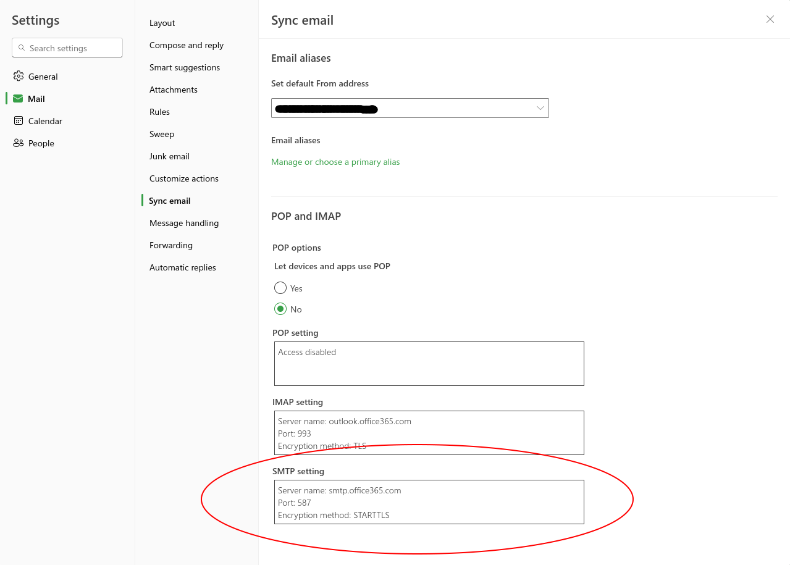
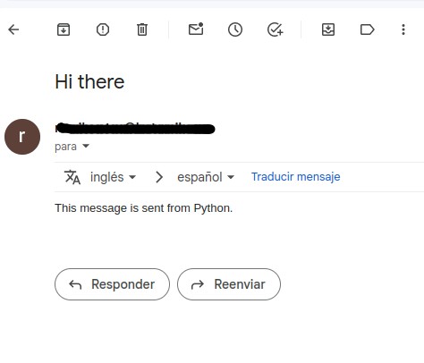

In Python, we can use the `smtplib` standard module to create a SMTP session that can be used to send an email.

The simplest way to do that is by sending a plain text, where the Subject and the body are storage in the same `string` object (see `message` varible in the the script below).


## Script


Here is a small script that makes this mini task of sending an email possible.

```python
# send_email.py

import smtplib


if __name__=="__main__":
    sender_email = "youremail@address.com"
    password = "YOUR-PASSWORD"
    receiver_email = "receiver@email.com"
    message = """Subject: Hi there

    This message is sent from Python."""

    # set up the SMTP server
    s = smtplib.SMTP(host="smtp.office365.com", port=587)
    s.starttls()
    s.login(sender_email, password)

    # send the email
    s.sendmail(sender_email, receiver_email, message)
    
    # close session
    s.close()

```


## Host and Port
The host name and port for the creation of the SMTP object depends on the Email provider. 

For instance, in Outlook (on the browser) you can get the port number and the SMTP host by going to _settings > Mail > Sync email section_. 




## Send the email

Run the script and the receiver will receive it!

```sh
python send_email.py
```



