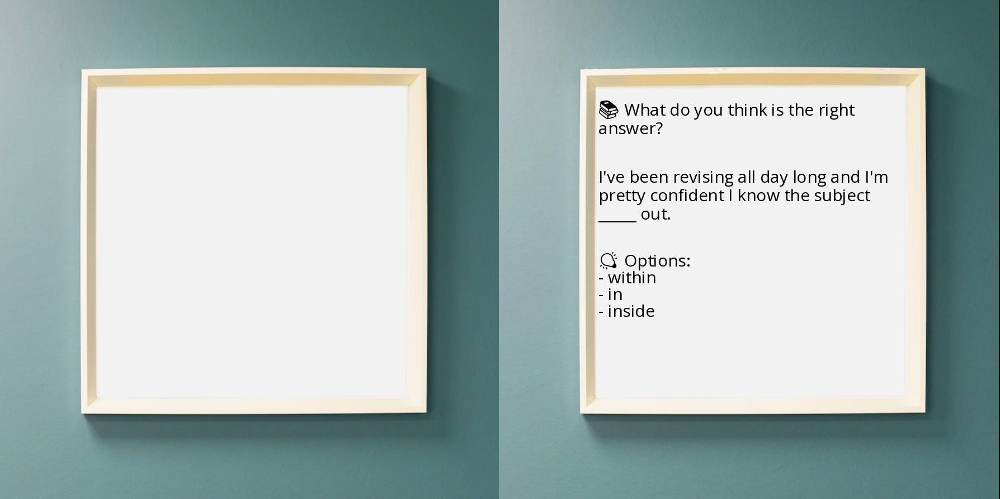

In this small article I will show how you can get an image with text (right on the next image) from a template one (left).


I wanted to implement this in my site [englishstuff.online](https://englishstuff.online/), where I would generate these kind of images from Quiz questions collected from the site database and afterwards I would be able to post them on social media. However, I decided not to because the images looked ugly, but I learned how to do it.





Firstly, we need to install the packages _pilmoji_ and _pillow_ for allowing to manipute images.

```bash

python -m pip install pillow pilmoji

```

Aferwards, create a Python script like the one below.


In the script we write line by line after offsets in both directions (height and width). On of those offsets, the `height_offset` gets updated since the "cursor" needs to be located in the next "image line".

Meanwhile the script needs to make sure to wrap some text if a text line if larger that the expected. That is why we have the function `get_wrapped_text`.


```python

from PIL import Image, ImageDraw, ImageFont
from pilmoji import Pilmoji

TEXT = """📚 What do you think is the right answer?

I've been revising all day long and I'm pretty confident I know the subject _____ out.

💡 Options:
- within
- in
- inside

"""
FONT_SIZE = 30
TEXT_COLOR = (0, 0, 0)


def get_wrapped_text(text: str, font: ImageFont.ImageFont, line_length: int):
    lines = [""]
    for word in text.split(" "):
        line = f"{lines[-1]} {word}".strip()
        if font.getlength(line) <= line_length:
            lines[-1] = line
        else:
            lines.append(word)
    return "\n".join(lines)


if __name__ == "__main__":
    font_object = ImageFont.truetype("OpenSansEmoji.ttf", FONT_SIZE)
    imgObject = Image.open("template.jpeg")
    width, height = imgObject.size
    height_offset = height * 0.2
    width_offset = width * 0.2

    for line_text in TEXT.split("\n"):
        wrapped_line_text = get_wrapped_text(
            line_text, font_object, line_length=width - 2 * width_offset
        )
        number_of_produced_lines = len(wrapped_line_text.split("\n"))
        breakline_size = 0

        # add additional line if the line text is empty
        if line_text == "":
            breakline_size = FONT_SIZE

        # draw on image
        drawing_object = ImageDraw.Draw(imgObject)
        drawing_object.multiline_text(
            (width_offset, height_offset),
            wrapped_line_text,
            font=font_object,
            fill=TEXT_COLOR,
        )
        height_offset += FONT_SIZE * number_of_produced_lines + breakline_size

    if height_offset > height:
        print("You may not like the output image.")
    imgObject.save("output.jpeg")


```

With everything wrote and set up, just run the script `python script.py` and an image _output.jpeg_ will be generated.


If you want to test this out with the example provided, download the following files needed:

- [⬇️ script.py](script.py)
- [⬇️ Font OpenSansEmoji.ttf](OpenSansEmoji.ttf)
- [⬇️ Template image](template.jpeg)